# Laboratorio: Red Hat Ansible Automation Platform (AAP) — Ejercicio 1

## Introducción a Red Hat Ansible Automation Platform

**Red Hat Ansible Automation Platform (AAP)** es la plataforma empresarial para automatizar TI a escala: orquestación de playbooks, catálogos de contenido aprobado, integración con Git y sistemas externos, y gobierno (RBAC, auditoría, flujos de aprobación). Sobre **OpenShift** se despliega mediante el operador de AAP como un recurso personalizado que levanta los servicios necesarios (API, Controller, base de datos, mensajería/cola según la configuración, etc.).

En este laboratorio configurarás los **elementos básicos de identidad y acceso** (organización, equipos, usuarios y roles) y conectarás **OpenShift** como destino de automatización mediante **credencial**, **inventario** y, cuando proceda, **token de usuario**.

---

## Topología del entorno de laboratorio

La instalación de referencia está definida en el manifiesto **`automation-platform-install-ansible-automation-platform.yaml`**. En el árbol de este laboratorio suele estar junto al material de instalación, por ejemplo: `lab-aap-ansible/automation-platform-install-ansible-automation-platform.yaml` (ruta relativa al repositorio `lab_correos`). A grandes rasgos:

- **Cluster**: OpenShift.
- **Namespace**: `ansible-automation-platform`.
- **Recurso**: `AnsibleAutomationPlatform` llamado `example`.
- **Componentes activos**: API de la plataforma (1 réplica), **Automation Controller**, **Event-Driven Ansible (EDA)** (scheduler y worker con 1 réplica cada uno), **PostgreSQL** para datos de la plataforma, **Redis** en modo *standalone*, ruta HTTPS con **TLS en el extremo (Edge)**.
- **Componentes deshabilitados en esta definición**: **Automation Hub** y **Ansible Lightspeed** (`disabled: true`), de modo que el laboratorio se centra en Controller/EDA frente a un clúster OpenShift.

Diagrama lógico de la topología instalada:

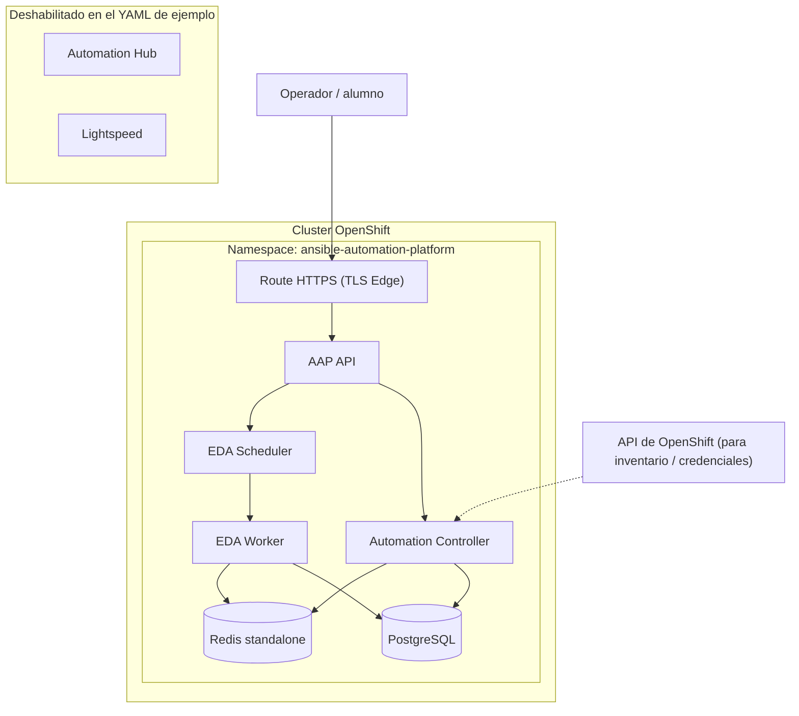
```mermaid
flowchart TB
  subgraph ocp[Cluster OpenShift]
    subgraph ns["Namespace: ansible-automation-platform"]
      route["Route HTTPS (TLS Edge)"]
      api["AAP API"]
      ctrl["Automation Controller"]
      eda_s["EDA Scheduler"]
      eda_w["EDA Worker"]
      db[("PostgreSQL")]
      redis[("Redis standalone")]
    end
  end

  user["Operador / alumno"] --> route
  route --> api
  api --> ctrl
  api --> eda_s
  eda_s --> eda_w
  ctrl --> db
  eda_w --> db
  ctrl --> redis
  eda_w --> redis

  subgraph disabled["Deshabilitado en el YAML de ejemplo"]
    hub["Automation Hub"]
    ls["Lightspeed"]
  end

  ocp_ext["API de OpenShift (para inventario / credenciales)"] -.-> ctrl
```

---

## Requisitos previos

- Acceso a la **URL** de la instancia de AAP desplegada en tu entorno (la proporciona el instructor o la plataforma del laboratorio).
- Usuario y contraseña (o método SSO) indicados para el laboratorio.
- Acceso de **lectura** (como mínimo) al clúster **OpenShift** de prácticas, para generar un token y definir inventario/credencial.

---

## Orden del laboratorio (pasos y capturas)

Todas las capturas están en la carpeta **`images/`**. Los nombres de archivo siguen el orden del flujo (p. ej. `Organization1.png`, `Organization2.png`, …).

### 1. LoginAAP

**Qué hace este paso:** accedes a la interfaz web de Ansible Automation Platform y te autenticas.

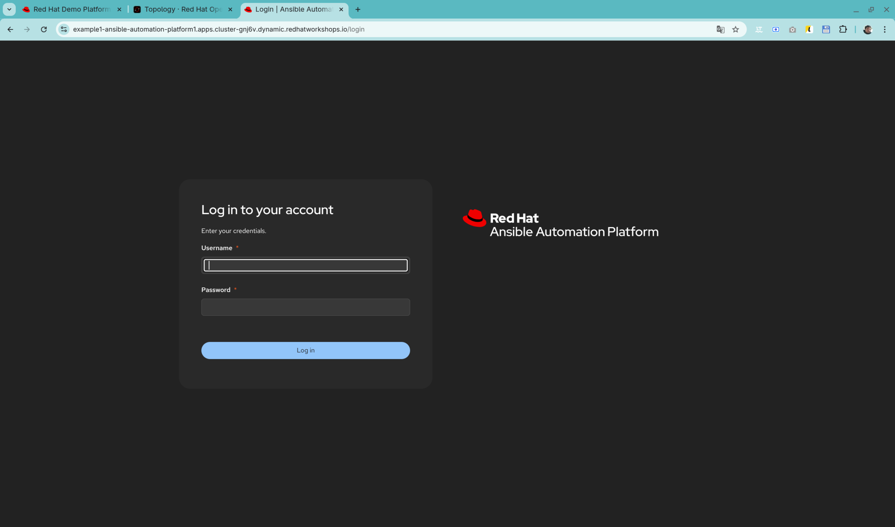

| Campo / dato | Valor en el laboratorio (referencia captura) |
|--------------|-----------------------------------------------|
| URL | La de tu entorno; en la captura aparece un host de ejemplo tipo `…ansible-automation-platform….apps.cluster-….dynamic.redhatworkshops.io/login`. |
| Username | El que te indique el instructor (p. ej. `admin` en entornos de taller). |
| Password | La contraseña del usuario anterior. |

Tras iniciar sesión debes poder usar **Access Management** y **Automation Controller**.

---

### 2. Organization

**Qué hace este paso:** creas una **organización** propia del laboratorio (`LabOrganization`) para agrupar usuarios, equipos y recursos aparte de `Default`.

#### 2.1 Listado de organizaciones

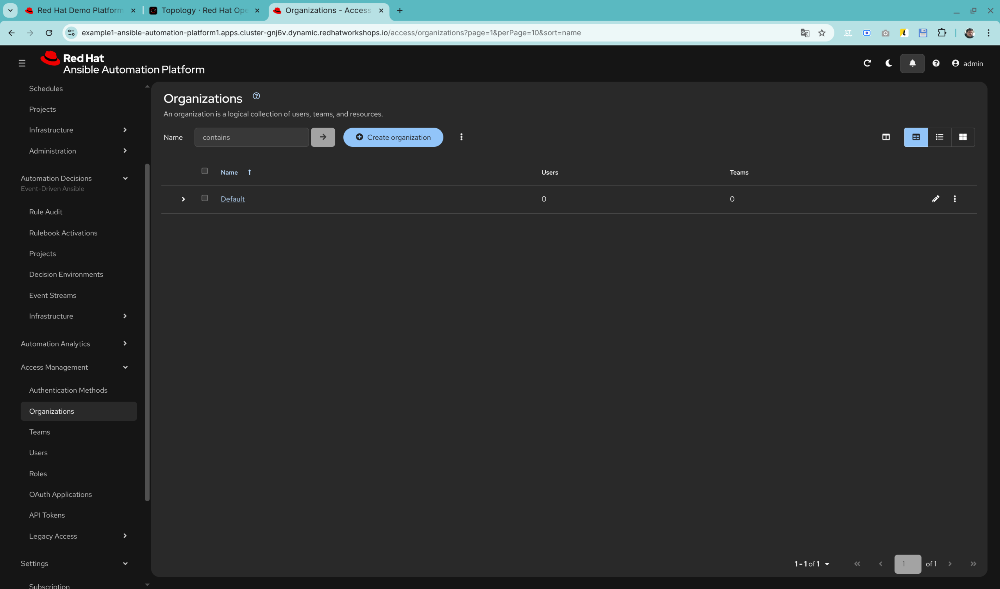

- **Acción:** **Access Management → Organizations → Create organization**.

#### 2.2 Detalles de la organización (asistente, paso 1)

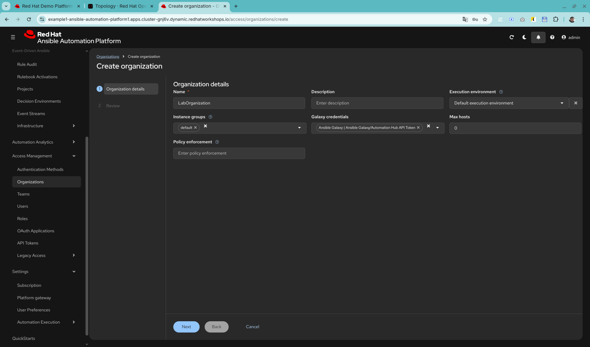

| Campo | Valor introducido |
|-------|-------------------|
| Name | `LabOrganization` |
| Description | (vacío en la captura) |
| Execution environment | `Default execution environment` |
| Instance groups | `default` |
| Galaxy credentials | `Ansible Galaxy \| Ansible Galaxy/Automation Hub API Token` (chip seleccionado) |
| Max hosts | `0` |

#### 2.3 Revisión antes de crear

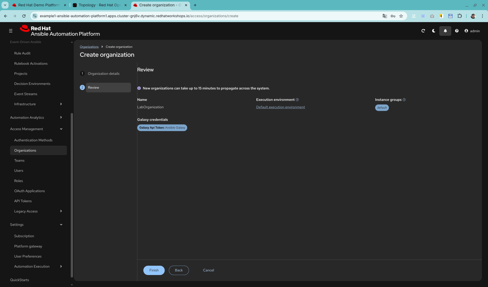

- Comprueba **Name** `LabOrganization`, execution environment, instance group y Galaxy token; pulsa **Finish**.

#### 2.4 Detalle de la organización creada

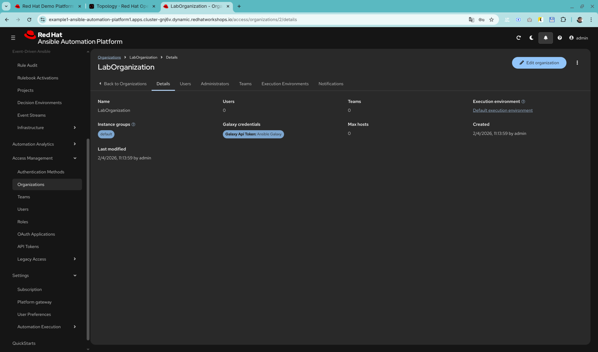

- Verificación: nombre `LabOrganization`, mismos execution environment / instance groups / Galaxy credentials que en el formulario.

#### 2.5 Listado con Default y LabOrganization

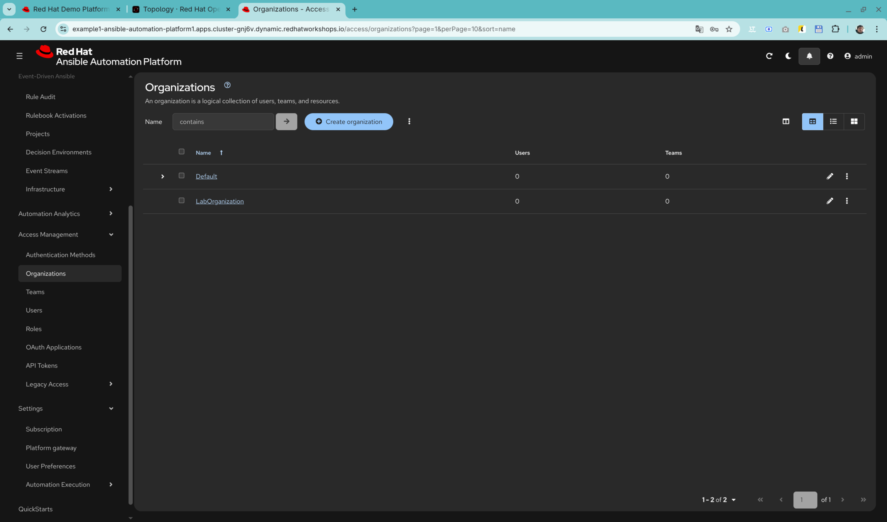

- Debes ver **`Default`** y **`LabOrganization`**.

---

### 3. Team

**Qué hace este paso:** creas **dos equipos** en `LabOrganization`: uno para perfil administrador del lab y otro para perfil usuario.

#### 3.1 Equipos vacíos

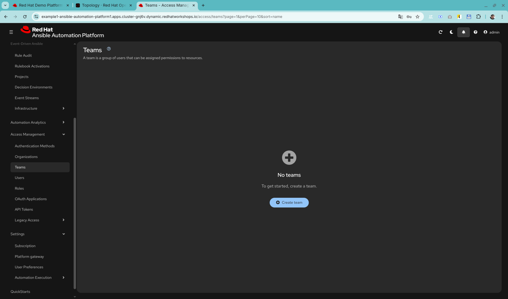

- **Acción:** **Access Management → Teams → Create team**.

#### 3.2 Crear equipo administrador


| Campo | Valor introducido |
|-------|-------------------|
| Name | `TeamAdminLabOrganization` |
| Description | (vacío) |
| Organization | `LabOrganization` |

#### 3.3 Detalle del equipo administrador


#### 3.4 Crear equipo usuario

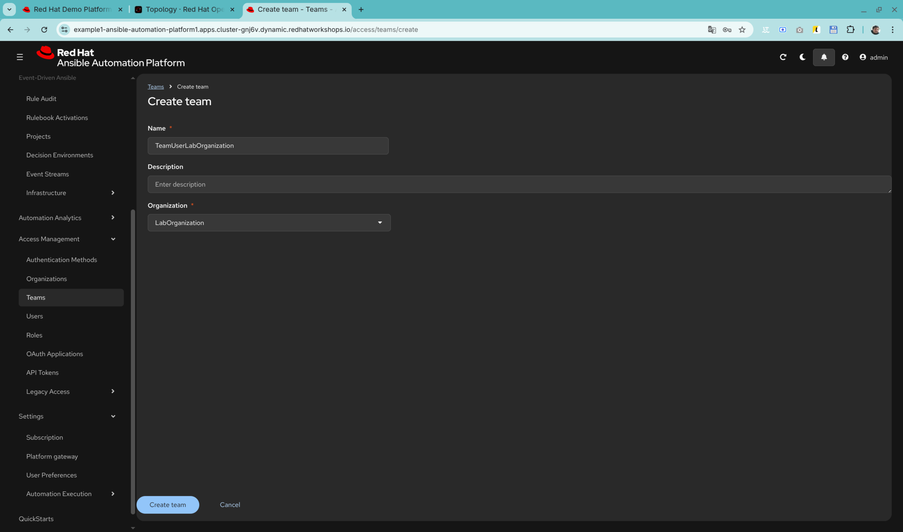

| Campo | Valor introducido |
|-------|-------------------|
| Name | `TeamUserLabOrganization` |
| Description | (vacío) |
| Organization | `LabOrganization` |

#### 3.5 Detalle del equipo usuario

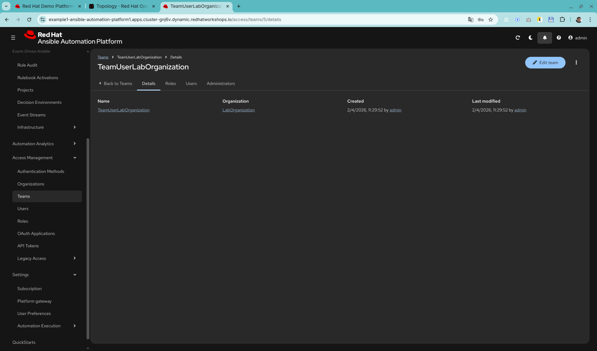

#### 3.6 Listado de ambos equipos

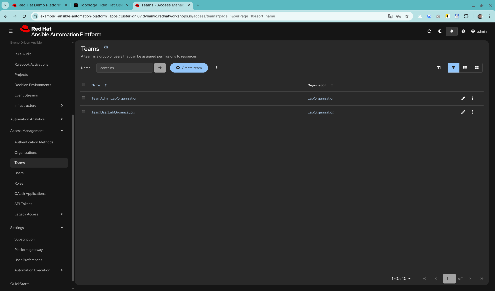

| Name | Organization |
|------|----------------|
| `TeamAdminLabOrganization` | `LabOrganization` |
| `TeamUserLabOrganization` | `LabOrganization` |

---

### 4. User

**Qué hace este paso:** das de alta **dos usuarios normales** asociados a `LabOrganization` que usarás junto con los equipos anteriores.

#### 4.1 Listado de usuarios (antes de crear los del lab)

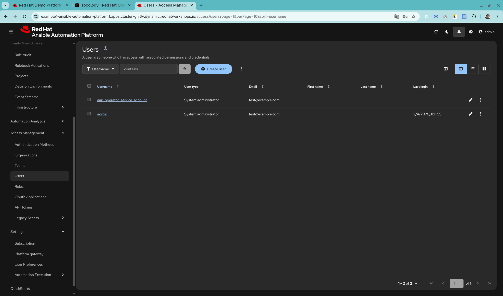

- **Acción:** **+ Create user**.

#### 4.2 Crear usuario “admin del lab” (no es system admin)

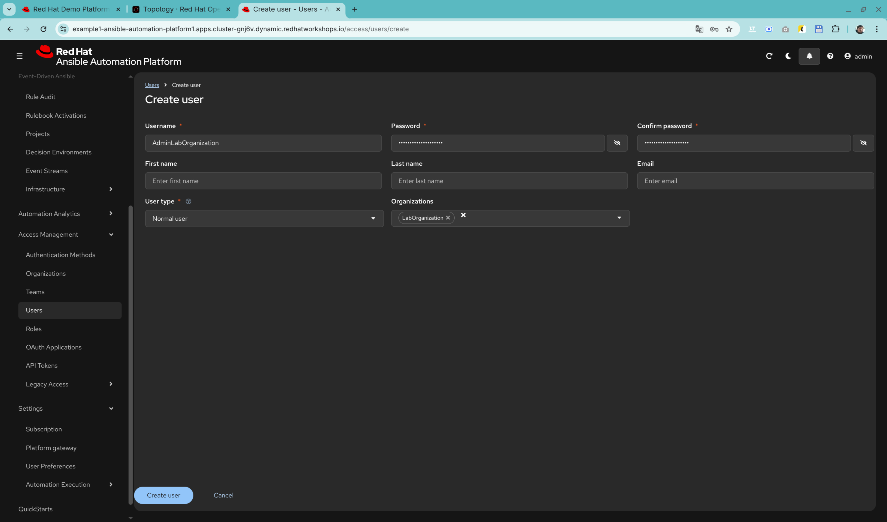

| Campo | Valor introducido |
|-------|-------------------|
| Username | `AdminLabOrganization` |
| Password / Confirm password | (la que definas para el laboratorio; en la captura está oculta) |
| First name / Last name / Email | (vacíos en la captura) |
| User type | `Normal user` |
| Organizations | `LabOrganization` |

#### 4.3 Detalle del usuario AdminLabOrganization

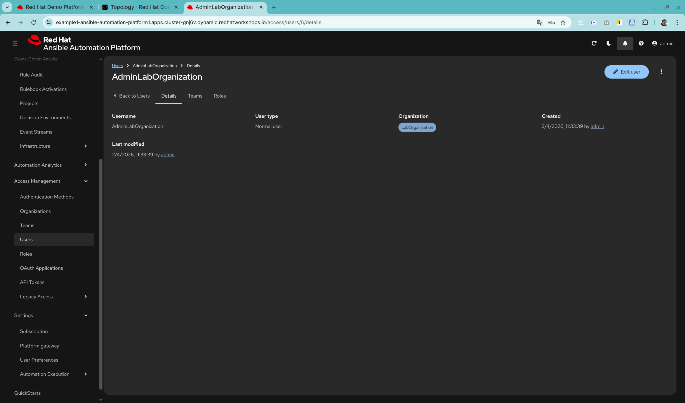

#### 4.4 Crear usuario “usuario del lab”


| Campo | Valor introducido |
|-------|-------------------|
| Username | `UserLabOrganization` |
| Password / Confirm password | (la que definas) |
| First name / Last name / Email | (vacíos en la captura) |
| User type | `Normal user` |
| Organizations | `LabOrganization` |

#### 4.5 Detalle del usuario UserLabOrganization

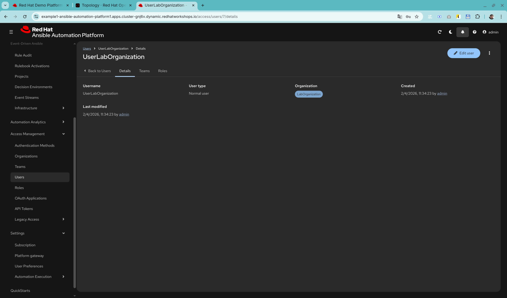

#### 4.6 Listado con los usuarios del laboratorio

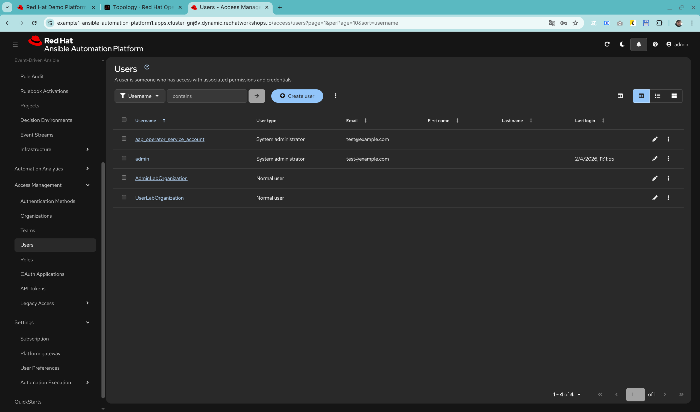

- Además de `admin` y cuentas de sistema, deben aparecer **`AdminLabOrganization`** y **`UserLabOrganization`** como *Normal user*.

---

### 5. UserTeam

**Qué hace este paso:** **asignas cada usuario al equipo que le corresponde** para que herede los roles organizacionales del equipo en pasos posteriores.

#### 5.1 Usuario AdminLabOrganization — sin equipos

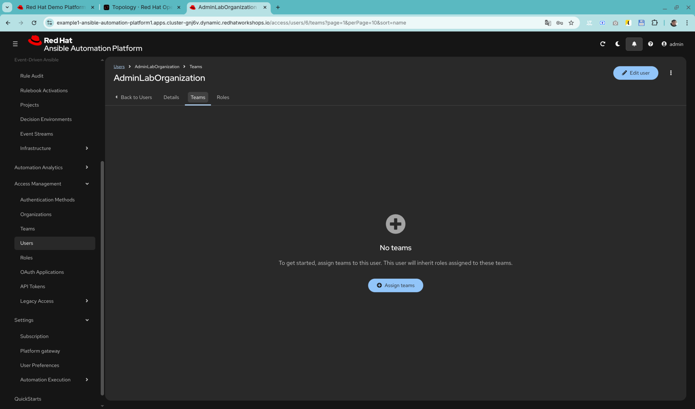

- Pestaña **Teams → Assign teams**.

#### 5.2 Modal: asignar TeamAdminLabOrganization a AdminLabOrganization

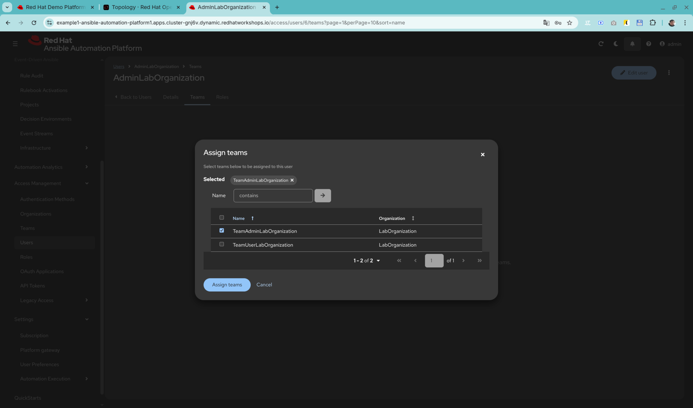

| Selección | Valor |
|-----------|--------|
| Usuario | `AdminLabOrganization` |
| Equipo marcado | `TeamAdminLabOrganization` (`LabOrganization`) |
| Equipo no marcado | `TeamUserLabOrganization` |

- Pulsa **Assign teams**.

#### 5.3 Usuario AdminLabOrganization — equipo asignado

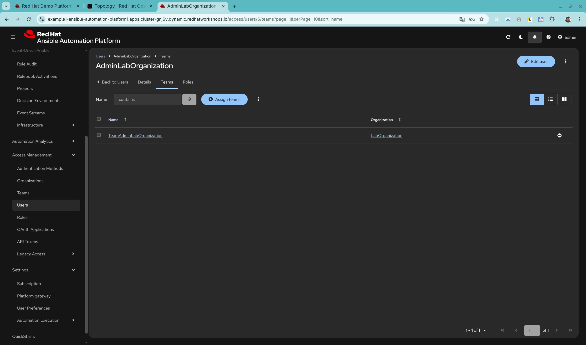

#### 5.4 Usuario UserLabOrganization — sin equipos

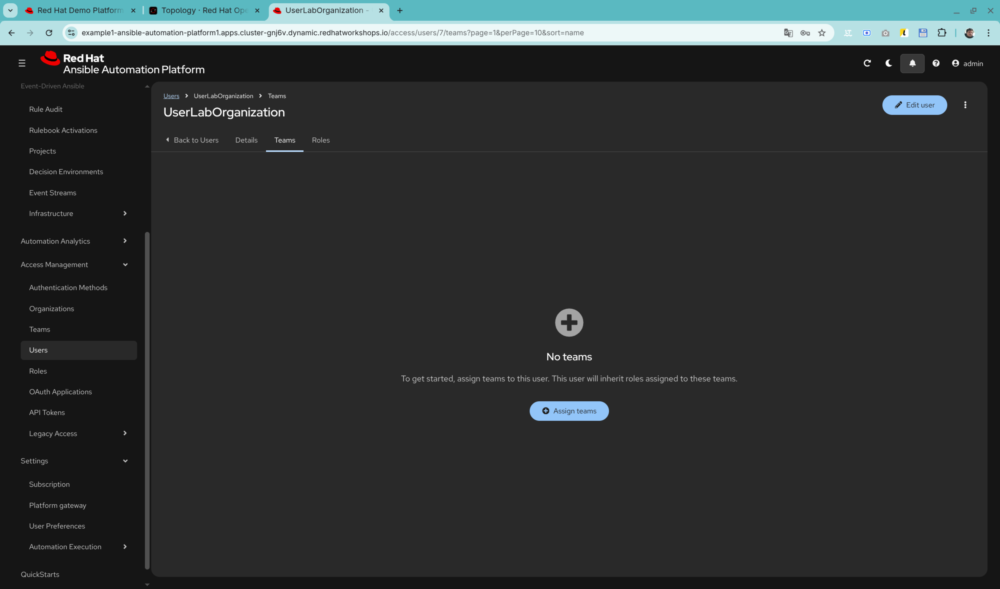

#### 5.5 Modal: asignar TeamUserLabOrganization

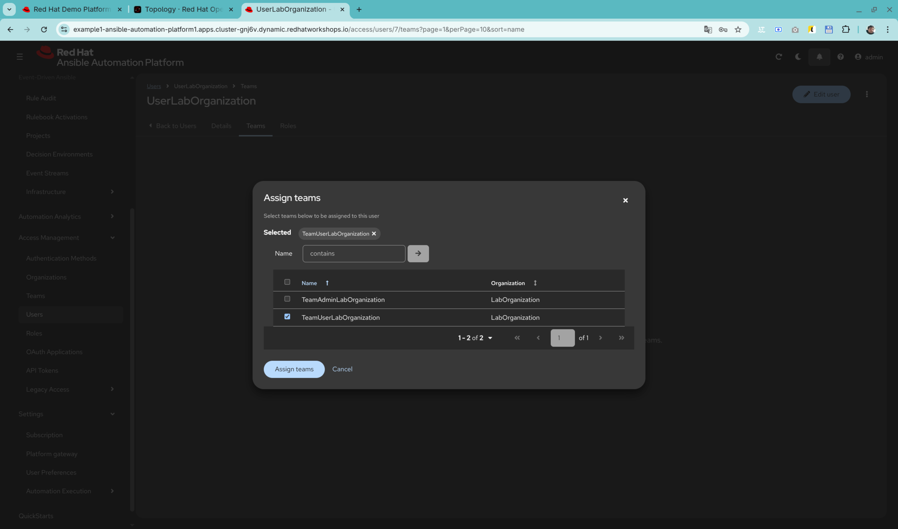

| Selección | Valor |
|-----------|--------|
| Usuario | `UserLabOrganization` |
| Equipo marcado | `TeamUserLabOrganization` |

#### 5.6 Usuario UserLabOrganization — equipo asignado


---

### 6. RolesOrganizationTeam

**Qué hace este paso:** desde **Organizations → LabOrganization → Teams** asignas **roles a nivel de organización** a cada equipo: un conjunto amplio para administradores del lab y un conjunto reducido para usuarios.

#### 6.1 Punto de partida: equipos de la organización

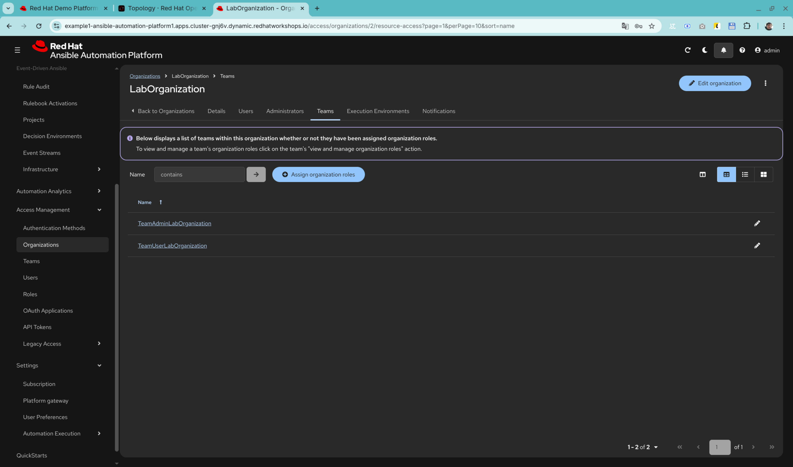

- **Acción:** **+ Assign organization roles**.

#### 6.2 Equipo administrador — paso “Select team(s)”

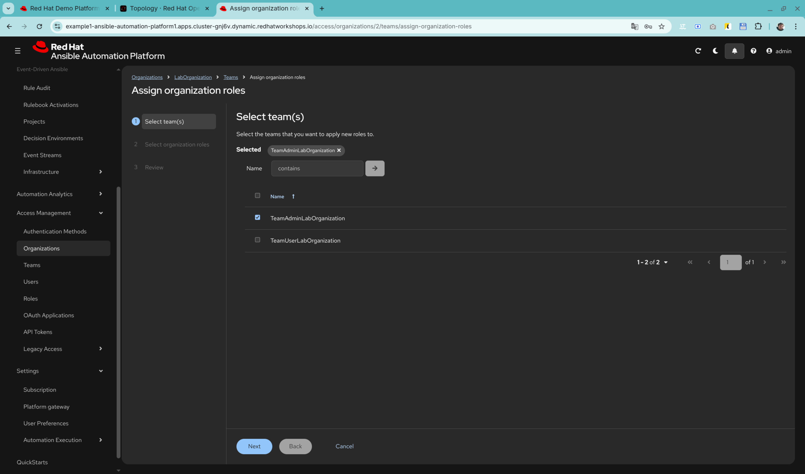

| Selección | Valor |
|-----------|--------|
| Equipo marcado | `TeamAdminLabOrganization` |
| Equipo sin marcar | `TeamUserLabOrganization` |

- **Next**.

#### 6.3 Equipo administrador — “Select organization roles”

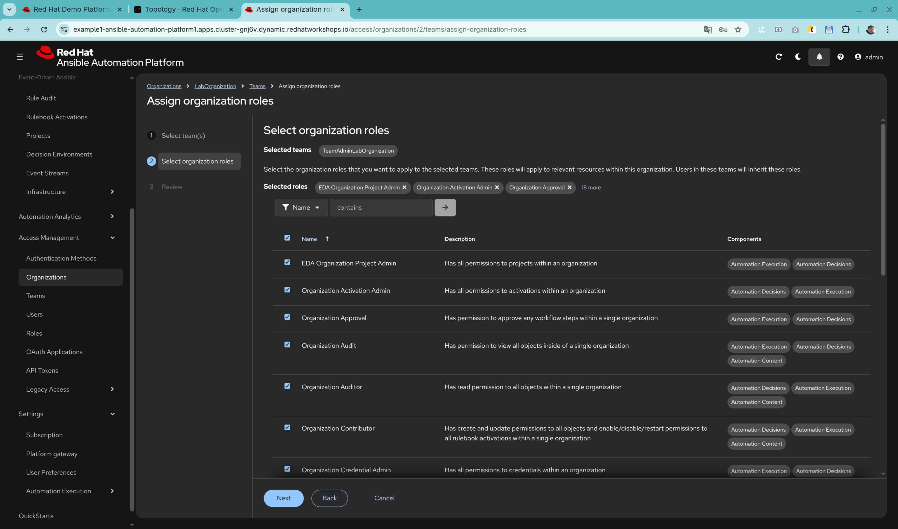

- En la captura se seleccionan **muchos roles** de organización (EDA Organization Project Admin, Organization Activation Admin, Organization Approval, Organization Audit, Organization Auditor, Organization Contributor, Organization Credential Admin, etc.); el resumen indica **21 roles** en total. Marca el mismo conjunto que pida tu guión o replica la selección de la imagen.

#### 6.4 Equipo administrador — Review

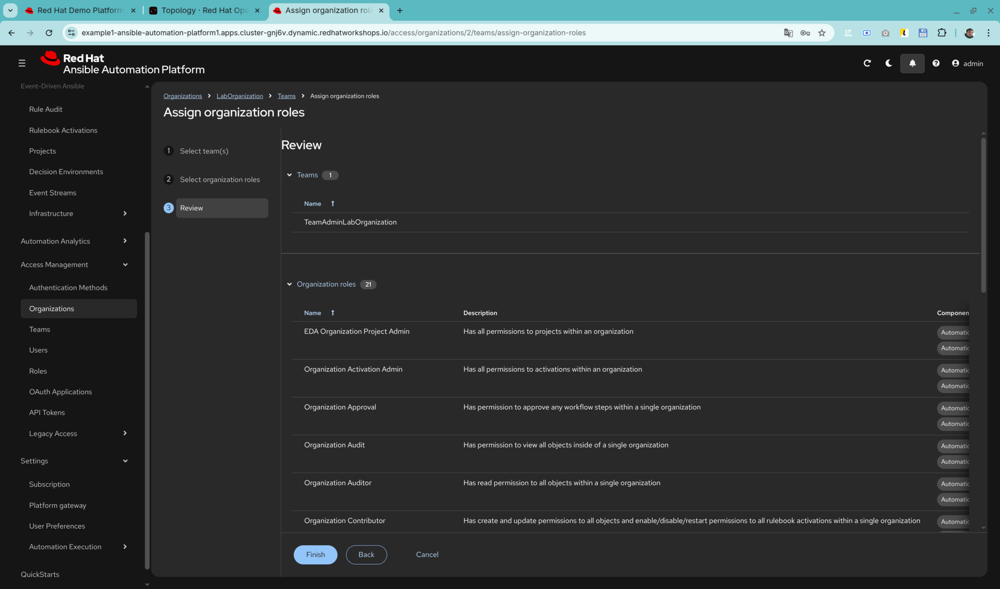

- **Teams:** `TeamAdminLabOrganization` — **Organization roles:** 21 — **Finish**.

#### 6.5 Verificación en el equipo: pestaña Roles

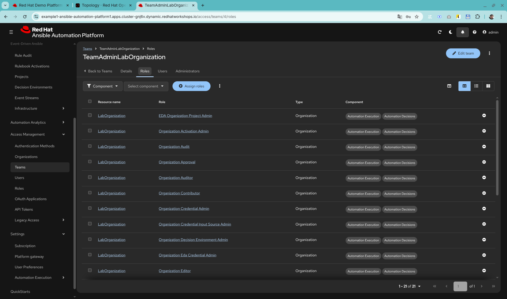

- Recurso **LabOrganization**, tipo **Organization**; lista de roles asignados al equipo (21 entradas en la captura).

#### 6.6 Equipo usuario — paso “Select team(s)” (sin selección)

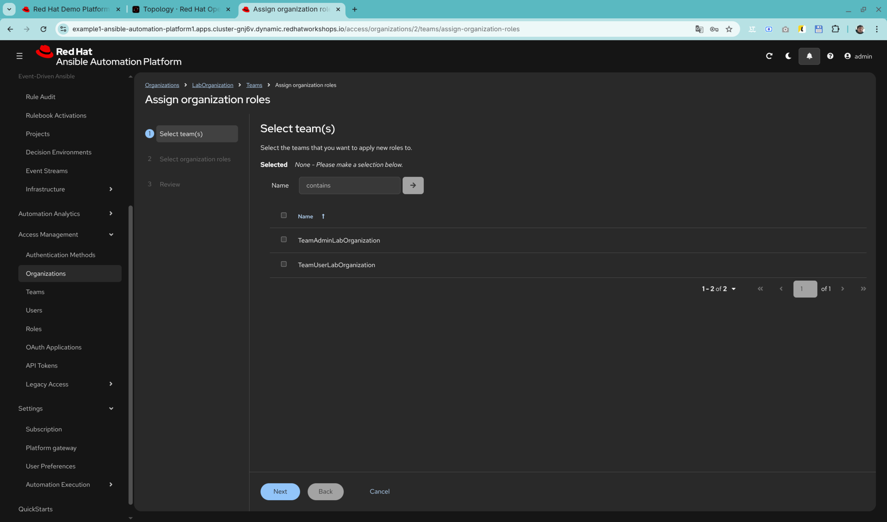

#### 6.7 Equipo usuario — seleccionar TeamUserLabOrganization


| Selección | Valor |
|-----------|--------|
| Equipo marcado | `TeamUserLabOrganization` |

#### 6.8 Equipo usuario — roles (parte 1)

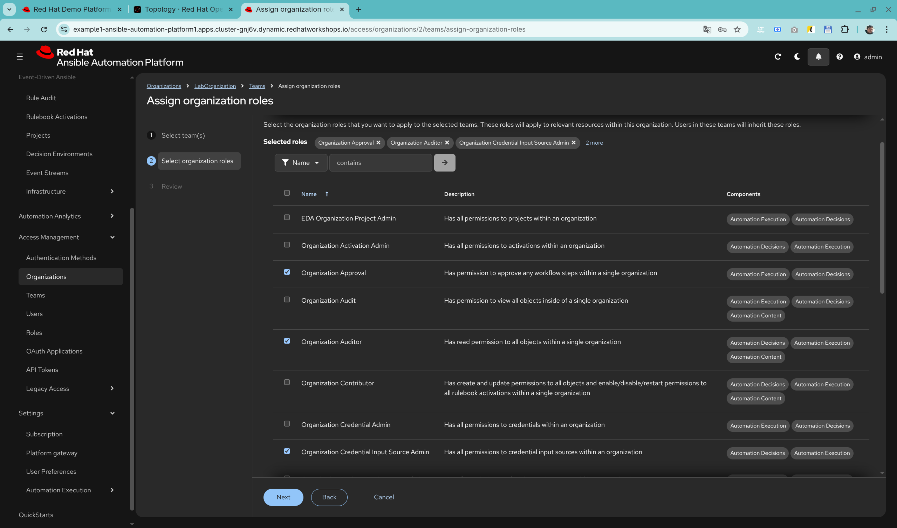

- Roles marcados en esta vista (entre otros): **Organization Approval**, **Organization Auditor**, **Organization Credential Input Source Admin** (y más según chips “+ N more”).

#### 6.9 Equipo usuario — roles (parte 2: Execute y Viewer)

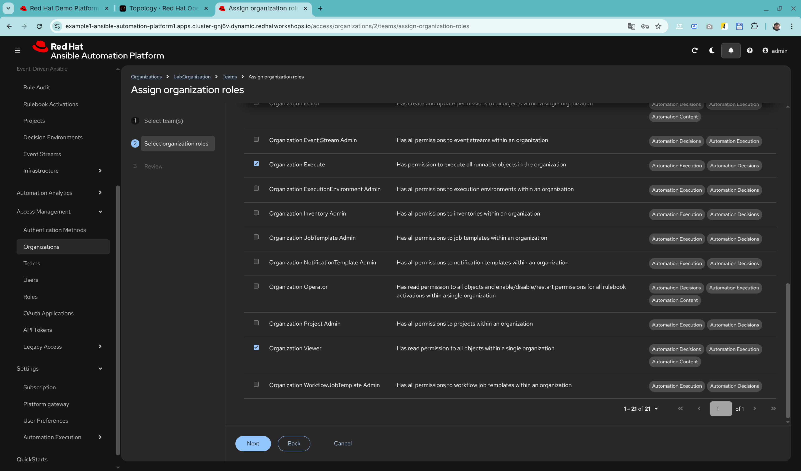

| Rol | Descripción breve |
|-----|-------------------|
| Organization Execute | Ejecutar objetos ejecutables de la organización |
| Organization Viewer | Lectura de objetos de la organización |

#### 6.10 Equipo usuario — Review (5 roles)

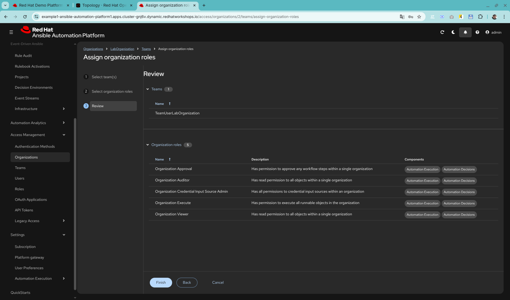

Roles finales asignados al equipo **`TeamUserLabOrganization`** sobre **`LabOrganization`**:

1. Organization Approval  
2. Organization Auditor  
3. Organization Credential Input Source Admin  
4. Organization Execute  
5. Organization Viewer  

- Pulsa **Finish**.

#### 6.11 Verificación: TeamUserLabOrganization — Roles

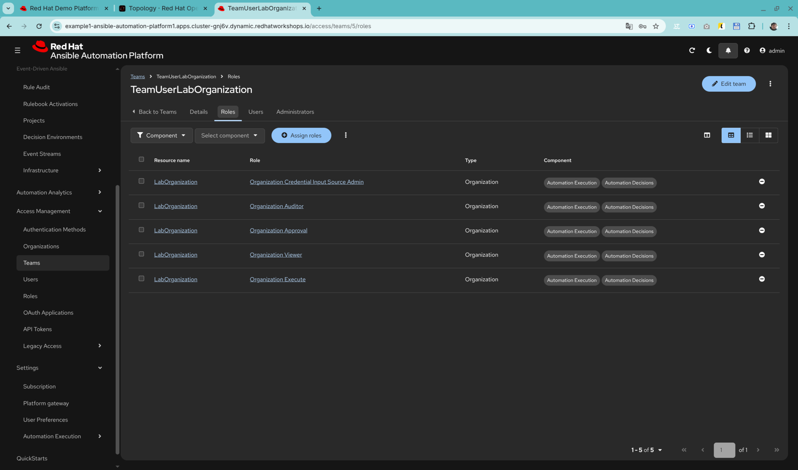

---

### 7. GetTokenOpenshiftUser

**Qué hace este paso:** obtienes un **token de API de OpenShift** con el usuario del clúster (p. ej. taller) para pegarlo en la credencial de AAP. **No uses el token de las capturas**: es solo ilustrativo; copia siempre el tuyo.

#### 7.1 SSO del clúster (si aplica)

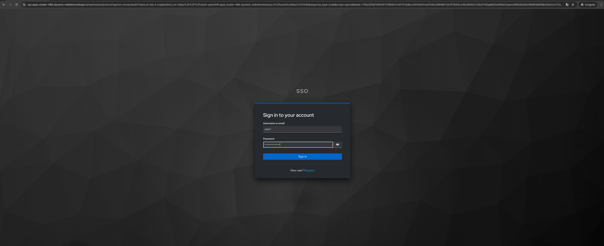

| Campo | Valor en la captura |
|-------|---------------------|
| Username or email | `user1` |
| Password | (oculta) |

#### 7.2 Consola OpenShift — copiar comando de login

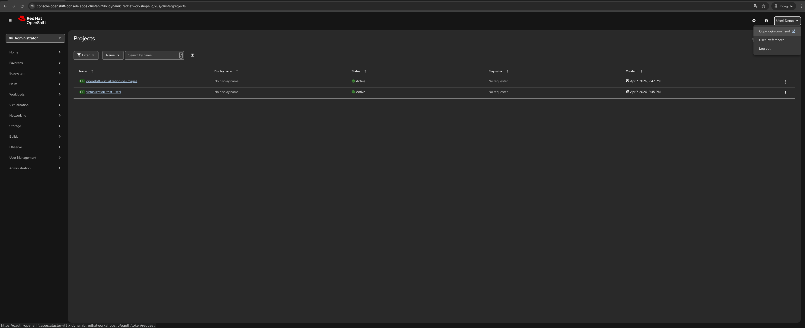

- Perspectiva **Administrator**, usuario de ejemplo **User1 Demo**.  
- Menú de usuario (arriba a la derecha) → **Copy login command** (o equivalente para mostrar token).  
- En la captura aparecen proyectos como `openshift-virtualization-os-images` y `virtualization-test-user1` (comprueba los tuyos).

#### 7.3 Página “Display token”

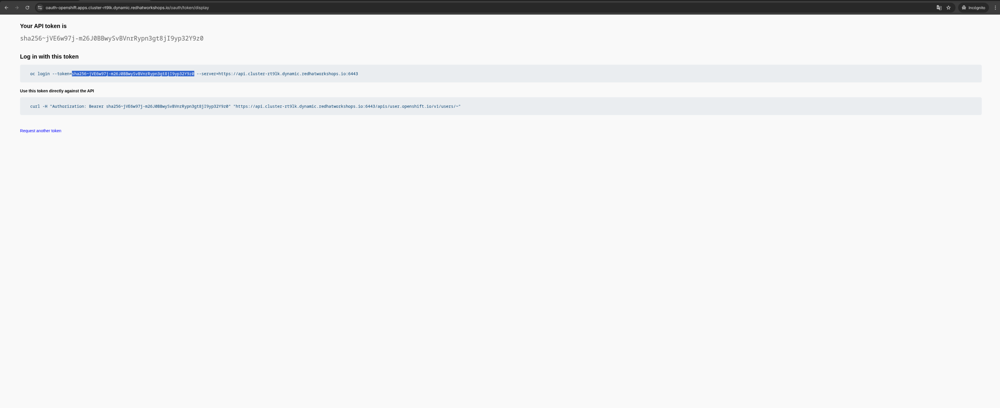

- Copia el **token** y el comando `oc login --token=… --server=https://api.<tu-cluster>:6443`.  
- Ese **server** y el **token** son los que usarás en la credencial del paso 8.

> **Nota:** Los tokens de usuario caducan; en producción suelen usarse **Service Accounts** y rotación de secretos.

---

### 8. OpenshiftCredential

**Qué hace este paso:** registras en **Automation Controller** una credencial de tipo **OpenShift or Kubernetes API Bearer Token** para que el inventario dinámico se autentique contra la API del clúster.

#### 8.1 Formulario de alta

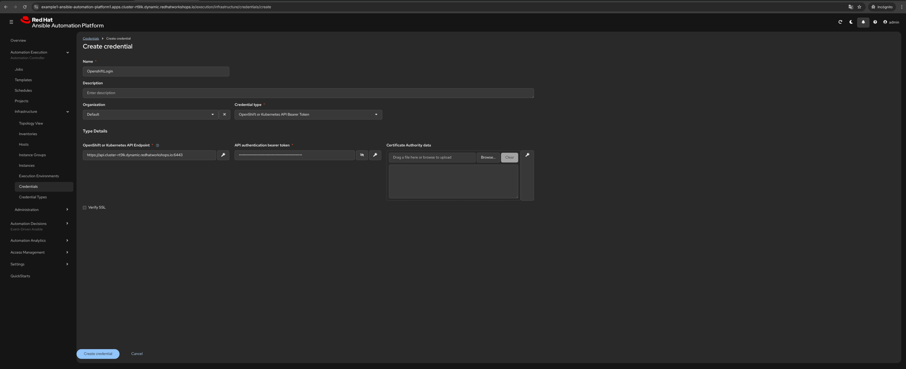

| Campo | Valor introducido (referencia captura) |
|-------|----------------------------------------|
| Name | `OpenShiftLogin` (en la vista de detalle aparece como `OpenshiftLogin`; usa un nombre consistente en tu entorno) |
| Description | (vacío) |
| Organization | `Default` |
| Credential type | `OpenShift or Kubernetes API Bearer Token` |
| OpenShift or Kubernetes API Endpoint | `https://api.<tu-cluster>:6443` (en captura: `https://api.cluster-….dynamic.redhatworkshops.io:6443`) |
| API authentication bearer token | Pega el token obtenido en el paso 7 |
| Certificate Authority data | (vacío en la captura) |
| Verify SSL | **Desmarcado** en la captura (equivalente a “No” en detalle) |

#### 8.2 Detalle de la credencial creada

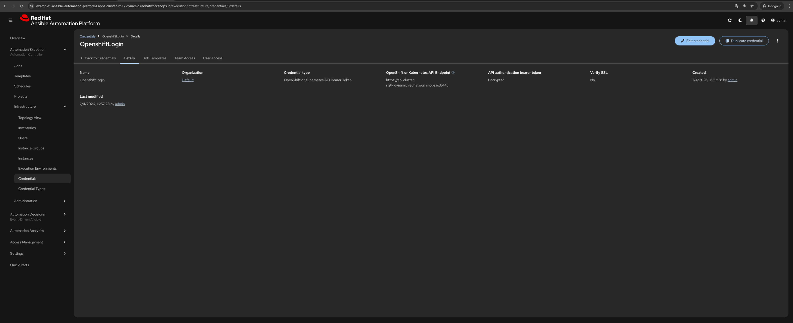

- Confirma tipo, endpoint, token **Encrypted** y **Verify SSL: No**.

---

### 9. OpenshiftInventory

**Qué hace este paso:** creas un **inventario** y una **fuente** de tipo **OpenShift Virtualization** que sincroniza VMs como hosts, usando la credencial anterior y un namespace concreto.

#### 9.1 Crear inventario (menú)

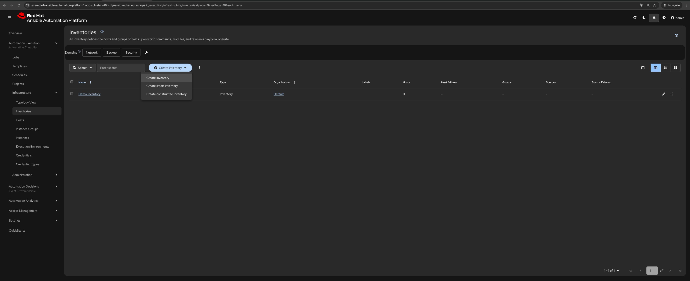

- **Infrastructure → Inventories → Create inventory → Create inventory**.

#### 9.2 Datos del inventario

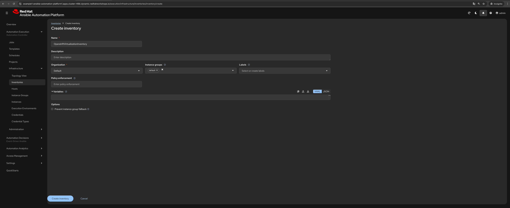

| Campo | Valor introducido |
|-------|-------------------|
| Name | `OpenshiftVirtualizationInventory` |
| Description | (vacío) |
| Organization | `Default` |
| Instance groups | `default` |
| Labels / Policy enforcement / Variables | (vacíos) |
| Prevent instance group fallback | Desmarcado |

#### 9.3 Detalle del inventario recién creado

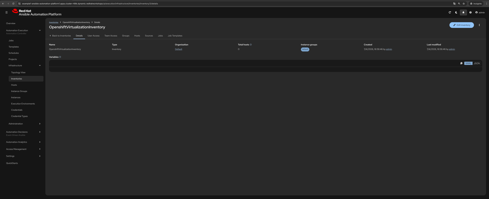

#### 9.4 Pestaña Sources — crear fuente

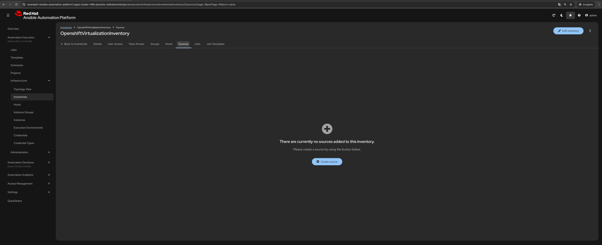

- **+ Create source**.

#### 9.5 Formulario de la fuente OpenShift Virtualization

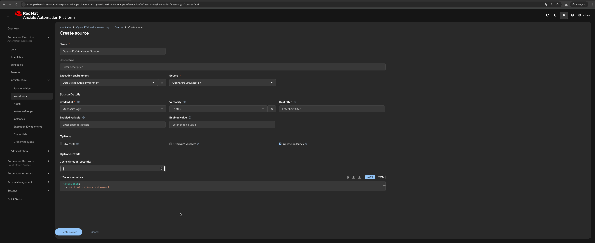

| Campo | Valor introducido |
|-------|-------------------|
| Name | `OpenshiftVirtualizationSource` |
| Description | (vacío) |
| Execution environment | `Default execution environment` |
| Source | `OpenShift Virtualization` |
| Credential | `OpenShiftLogin` (o el nombre exacto de tu credencial) |
| Verbosity | `1 (Info)` |
| Host Filter / Enabled variable / Enabled value | (vacíos) |
| Overwrite / Overwrite variables | Desmarcados |
| Update on launch | **Marcado** |
| Cache timeout (seconds) | `0` |

**Source variables (YAML):**

```yaml
namespaces:
  - virtualization-test-user1
```

(Ajusta el namespace si tu taller usa otro nombre.)

#### 9.6 Detalle de la fuente


#### 9.7 Sincronizar la fuente

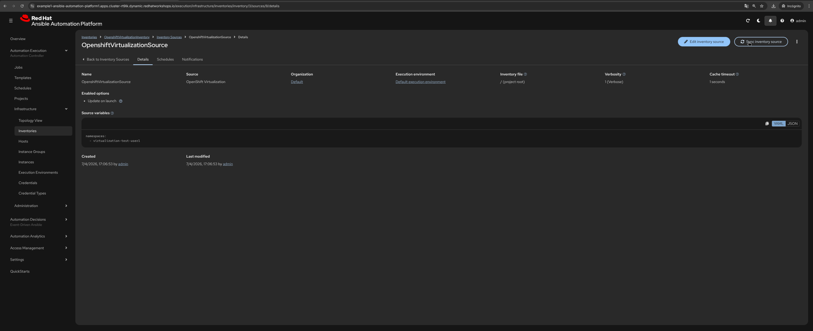

- **Sync inventory source** y espera a que el trabajo termine en éxito.

#### 9.8 Salida del job de sincronización

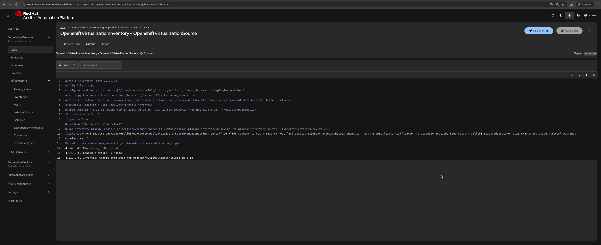

- En la captura el plugin `kubevirt` importa el inventario correctamente (mensaje tipo **Loaded 2 groups, 1 hosts**). Tu números pueden variar según el clúster.

#### 9.9 Grupos generados

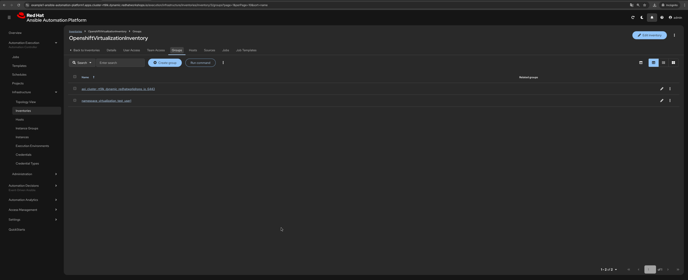

- Ejemplo de grupos: `api_cluster_<…>_6443`, `namespace_virtualization_test_user1`.

#### 9.10 Hosts importados

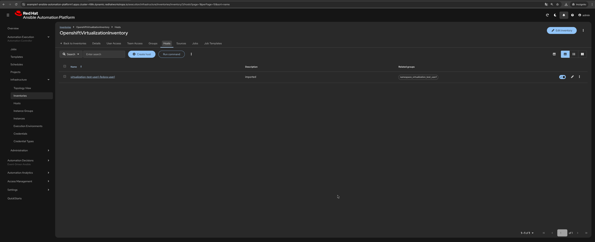

- Ejemplo de host: `virtualization-test-user1-fedora-user1`, grupo `namespace_virtualization_test_user1`, descripción `Imported`.

#### 9.11 Detalle del host

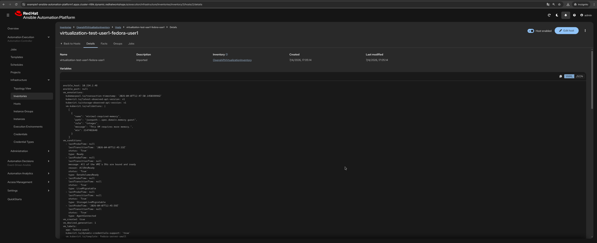

- Variables del host (YAML): p. ej. `ansible_host` con la IP de la VM, metadatos KubeVirt (`vm_labels`, `vm_conditions`, etc.).

---

### 10. SourceControlCredential (Automation Controller)

**Qué hace este paso:** creas una credencial de tipo **Source Control** en el **Automation Controller** para que un **proyecto Git** pueda clonar playbooks desde tu Gitea (usuario/contraseña).

#### 10.1 Listado de credenciales

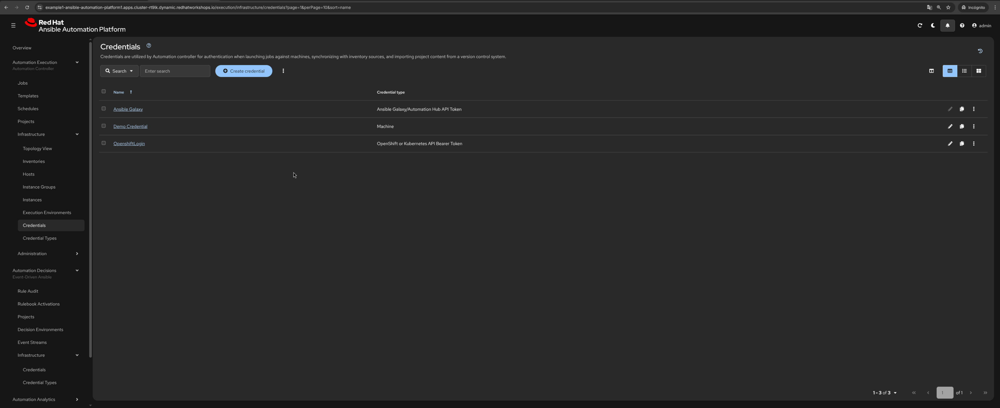

- **Ruta:** **Automation Execution → Automation Controller → Infrastructure → Credentials**.
- **Acción:** **+ Create credential**.

#### 10.2 Formulario de alta

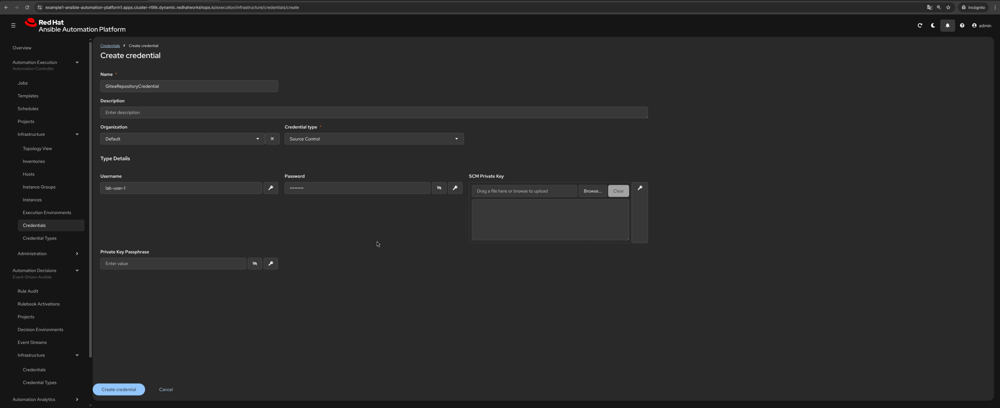

| Campo | Valor introducido |
|-------|-------------------|
| Name | `GiteaRepositoryCredential` |
| Description | (vacío) |
| Organization | `Default` |
| Credential type | `Source Control` |
| Username | `lab-user-1` |
| Password | La contraseña del usuario Gitea del taller |
| SCM Private Key / Private Key Passphrase | (vacíos; solo si tu entorno usa clave SSH) |

- Pulsa **Create credential**.

#### 10.3 Detalle de la credencial

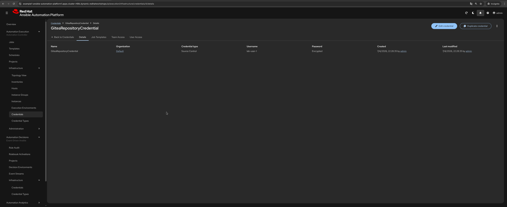

- Verifica tipo **Source Control**, usuario `lab-user-1` y contraseña **Encrypted**.

---

### 11. Project (Automation Controller)

**Qué hace este paso:** defines un **proyecto** en el Controller apuntando al repositorio Git del laboratorio (`lab-aap-ansible-exercise1`) para usar sus playbooks en plantillas de trabajo.

#### 11.1 Listado de proyectos

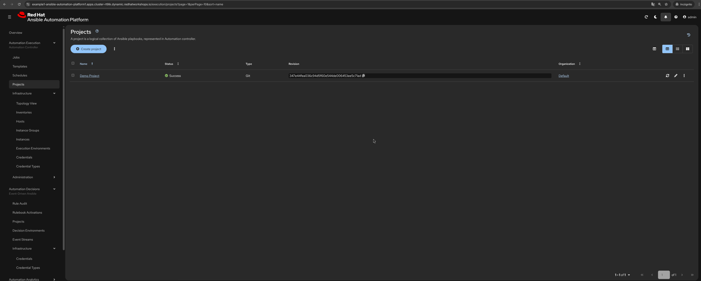

- **Ruta:** **Automation Execution → Automation Controller → Projects**.
- **Acción:** **Create project**.

#### 11.2 Formulario de alta

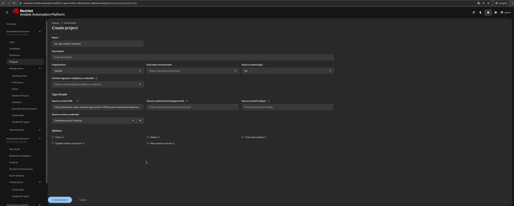

| Campo | Valor introducido |
|-------|-------------------|
| Name | `lab-aap-ansible-exercise1` |
| Description | (vacío) |
| Organization | `Default` |
| Execution environment | (ninguno en la captura) |
| Source control type | `Git` |
| Content signature validation credential | (ninguno) |
| Source control URL | `https://repository-gitea-operator.apps.<tu-cluster>.dynamic.redhatworkshops.io/lab-user-1/lab-aap-ansible-exercise1.git` (ajusta host al de tu Gitea) |
| Source control branch/tag/commit | (vacío) |
| Source control refspec | (vacío) |
| Source control credential | `GiteaRepositoryCredential` |
| Clean | **Marcado** |
| Delete / Track submodules / Update revision on launch / Allow branch override | Desmarcados |

- Pulsa **Create project**.

#### 11.3 Detalle — sincronización en curso

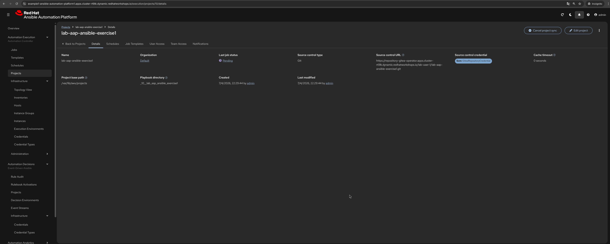

- **Last job status:** `Pending` mientras arranca la primera sincronización.  
- En algunas capturas el enlace de credencial aparece como `GitlabRepositoryCredential`; debe ser **la misma credencial** que creaste (`GiteaRepositoryCredential`) si el nombre en pantalla difiere por entorno.

#### 11.4 Detalle — sincronización correcta

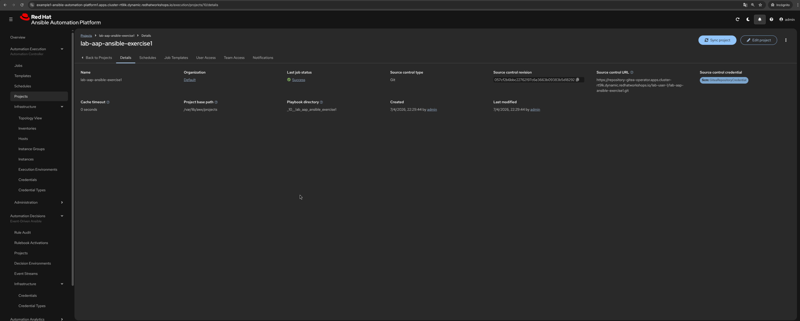

- **Last job status:** `Success`, **Source control revision** con hash Git, **Playbook directory** bajo `/var/lib/awx/projects` (ruta interna del controller).

---

### 12. DecisionEnvironment (Event-Driven Ansible)

**Qué hace este paso:** registras un **decision environment**: imagen de contenedor que EDA usa para ejecutar **rulebooks** con las dependencias soportadas por Red Hat.

#### 12.1 Listado vacío

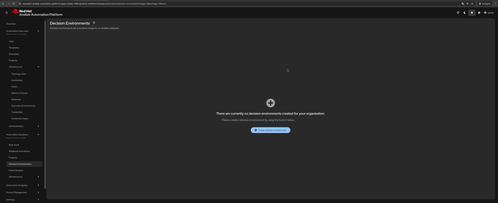

- **Ruta:** **Automation Decisions → Event-Driven Ansible → Decision Environments**.
- **Acción:** **Create decision environment**.

#### 12.2 Formulario de alta

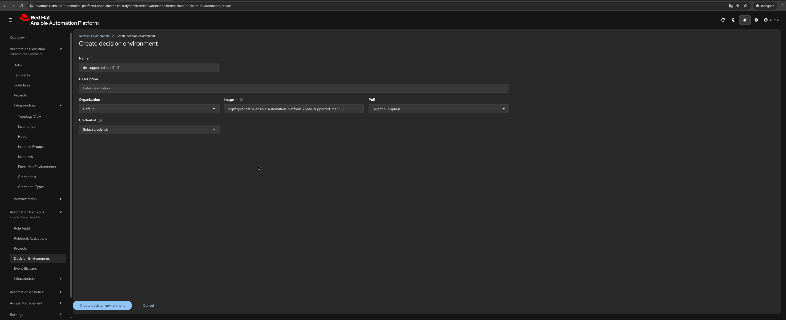

| Campo | Valor introducido |
|-------|-------------------|
| Name | `de-supported-rhel9:1.2` |
| Description | (vacío) |
| Organization | `Default` |
| Image | `registry.redhat.io/ansible-automation-platform-24/de-supported-rhel9:1.2` |
| Pull | En la captura aparece “Select pull option”; en el detalle final la política queda como **Always pull container before running** — elige la opción equivalente si tu UI lo muestra en el desplegable. |
| Credential | (ninguno en la captura; añade credencial de registry solo si tu clúster la exige para `registry.redhat.io`) |

- Pulsa **Create decision environment**.

#### 12.3 Detalle del decision environment

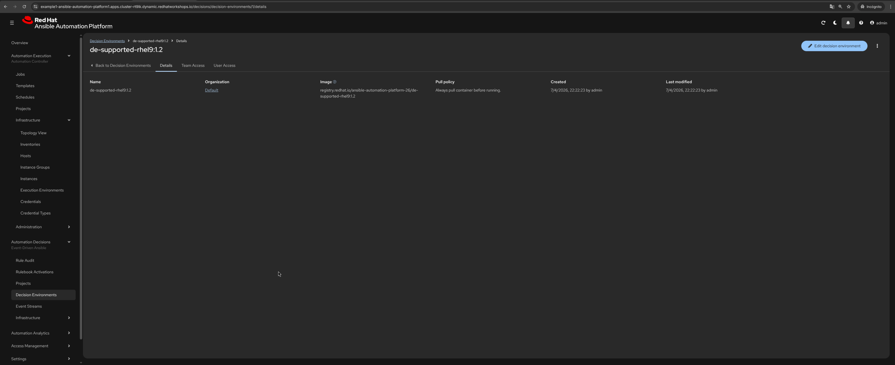

- Confirma **Image** y **Pull policy: Always pull container before running**.

---

### 13. EDASourceControlCredential (Automation Decisions)

**Qué hace este paso:** creas una credencial **Source Control** en la sección **EDA** (distinta del almacén del Controller) para que los **proyectos EDA** puedan autenticarse contra el mismo repositorio Git.

#### 13.1 Credenciales EDA vacías

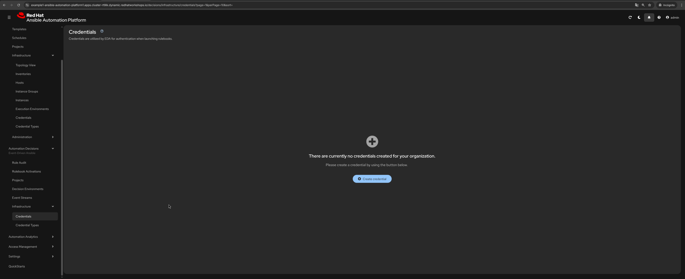

- **Ruta:** **Automation Decisions → Event-Driven Ansible → Infrastructure → Credentials**.
- **Acción:** **Create credential**.

#### 13.2 Formulario de alta

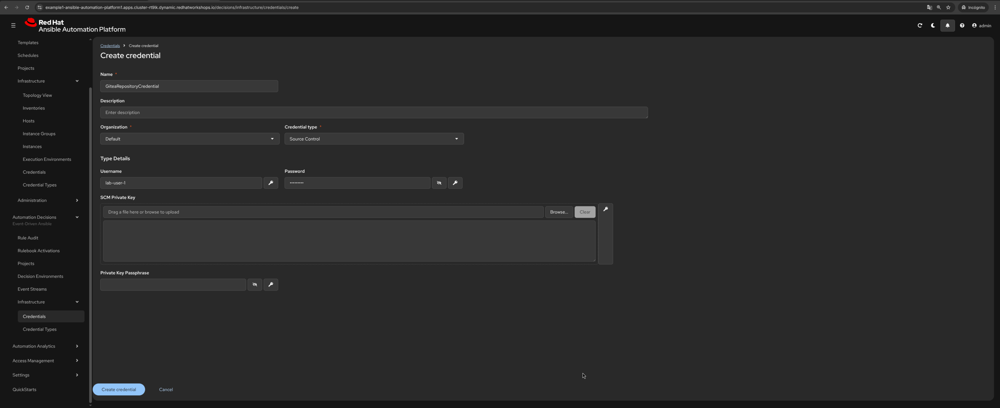

| Campo | Valor introducido |
|-------|-------------------|
| Name | `GiteaRepositoryCredential` |
| Description | (vacío) |
| Organization | `Default` |
| Credential type | `Source Control` |
| Username | `lab-user-1` |
| Password | Misma contraseña Gitea que en el paso 10 |
| SCM Private Key / Private Key Passphrase | (vacíos) |

#### 13.3 Detalle

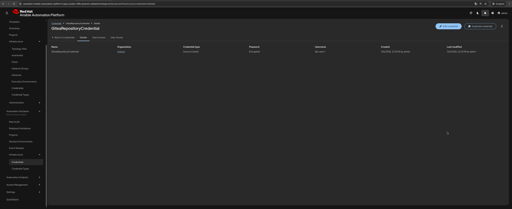

---

### 14. EDAProject (Automation Decisions)

**Qué hace este paso:** defines un **proyecto EDA** que enlaza el repositorio donde están los **rulebooks** (contenido distinto del proyecto del Controller, aunque aquí se reutiliza el mismo repo de ejemplo).

#### 14.1 Proyectos EDA vacíos

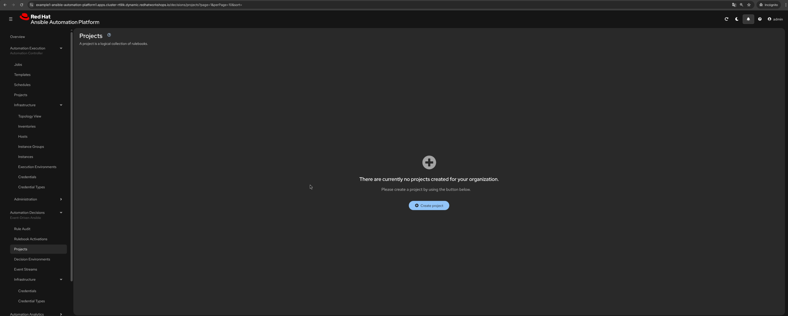

- **Ruta:** **Automation Decisions → Event-Driven Ansible → Projects** (no confundir con **Automation Controller → Projects**).
- **Acción:** **Create project**.

#### 14.2 Formulario de alta

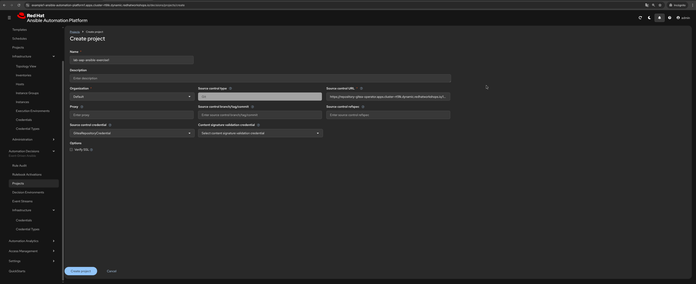

| Campo | Valor introducido |
|-------|-------------------|
| Name | `lab-aap-ansible-exercise1` |
| Description | (vacío) |
| Organization | `Default` |
| Source control type | `Git` |
| Source control URL | Mismo repo Git que en el paso 11 (`…/lab-user-1/lab-aap-ansible-exercise1.git`) |
| Proxy / branch / refspec | (vacíos en la captura) |
| Source control credential | `GiteaRepositoryCredential` (la credencial EDA del paso 13) |
| Content signature validation credential | (ninguno) |
| Verify SSL | **Desmarcado** en la captura |

#### 14.3 Detalle — importación en ejecución

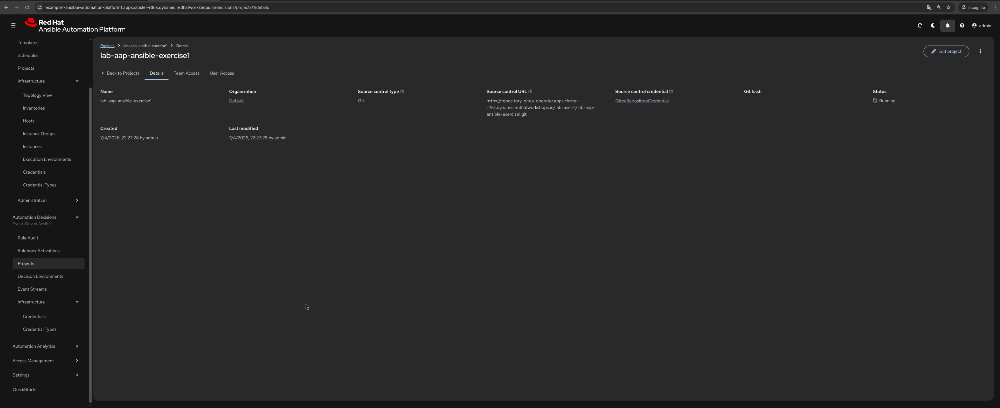

- **Status:** `Running` hasta que termine el clone/sync.

#### 14.4 Detalle — importación completada

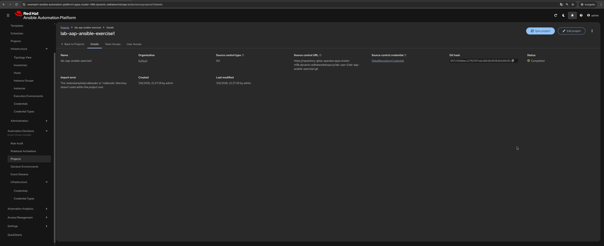

- **Status:** `Completed`, **Git hash** visible.  
- Si aparece un aviso de **Import error** indicando que no existe `extensions/eda/rulebooks` o `rulebooks` en la raíz del proyecto, el sync de Git ha funcionado pero aún **no hay rulebooks en esa ruta**; en este repositorio de laboratorio el ejemplo está en `extensions/eda/rulebooks/rulebook_webhook.yml` — asegúrate de que la rama sincronizada incluye esa estructura o ajusta el contenido del repo.

---

## Comprobación opcional con el playbook de ejemplo

En este repositorio, `test-exec-openshift.yaml` es un playbook de prueba que consulta namespaces en el clúster usando la colección `kubernetes.core`. Úsalo solo si el instructor ha configurado el proyecto y la credencial para ejecutarlo desde una plantilla de trabajo apuntando a tu inventario OpenShift.

---

## Referencia rápida de archivos

| Archivo | Uso |
|--------|-----|
| `images/` | Capturas por bloque: `LoginAAP.png`, `Organization1–5.png`, `Team1–6.png`, `User1–6.png`, `UserTeam1–6.png`, `RolesOrganizationTeamAdmin1–5.png`, `RolesOrganizationTeamUser1–6.png`, `GetTokenOpenshiftUser1–3.png`, `OpenshiftCredentials1–2.png`, `OpenshiftInventory1–11.png`, `SourceControlCredential1–3.png`, `Project1–4.png`, `DecisionEnvironment1–3.png`, `EDASourceControlCredential1–3.png`, `EDAProject1–4.png`. |
| `lab-aap-ansible/automation-platform-install-ansible-automation-platform.yaml` | Manifiesto de ejemplo de instalación de AAP y topología. |
| `test-exec-openshift.yaml` | Playbook de ejemplo contra la API de OpenShift. |
| `extensions/eda/rulebooks/rulebook_webhook.yml` | Ejemplo de rulebook EDA (webhook) para escenarios avanzados. |

---

*Laboratorio **lab-aap-ansible-exercise1** — configuración inicial de AAP e integración con OpenShift.*
